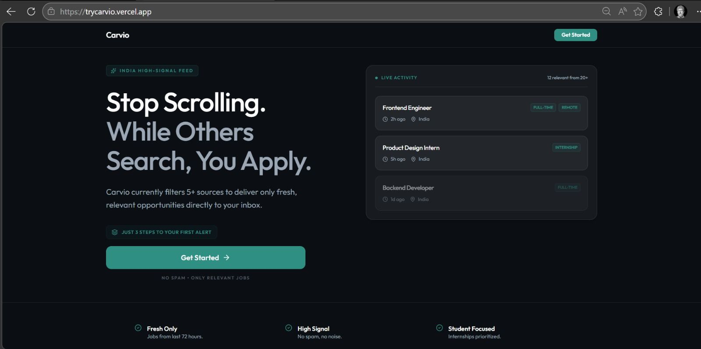
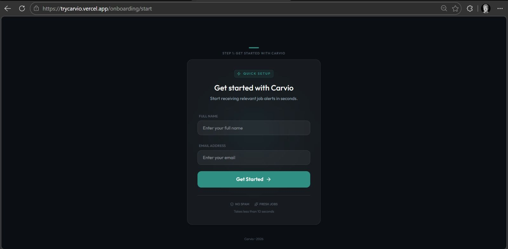
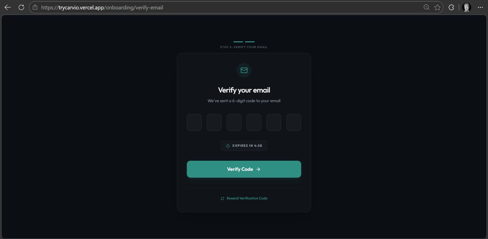
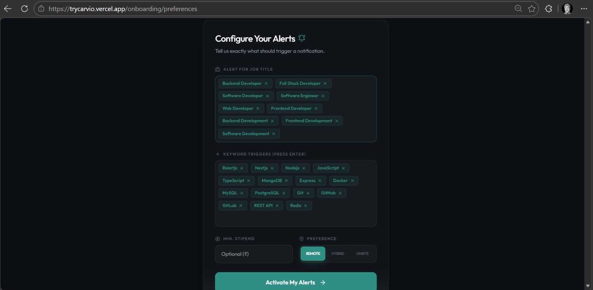
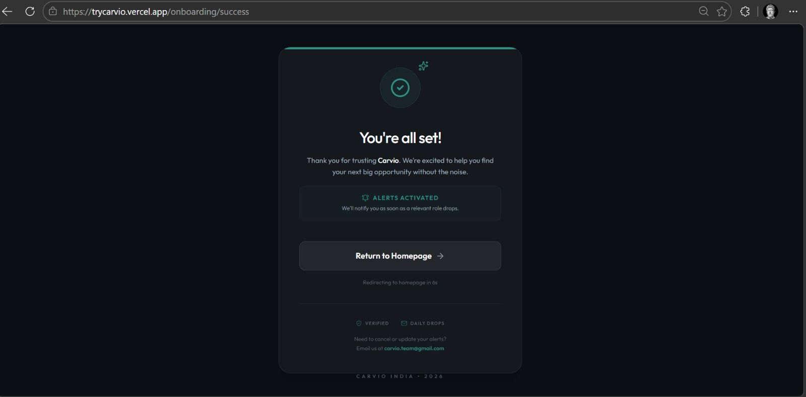
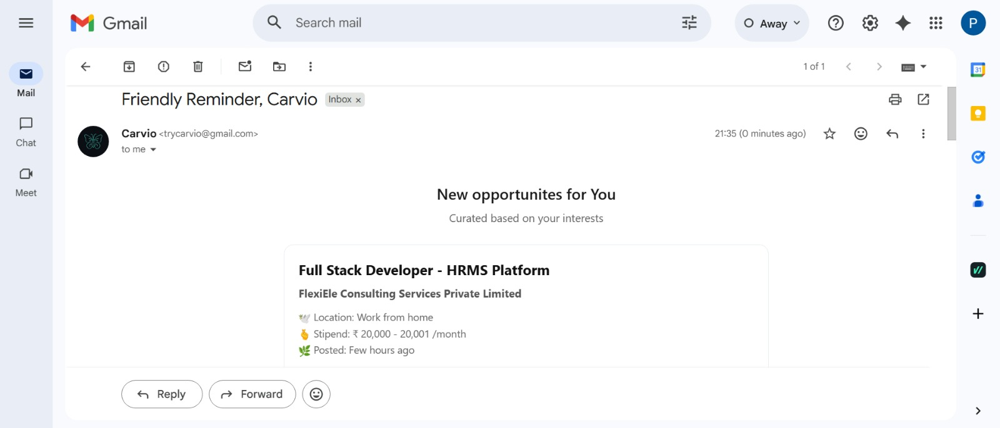

# Carvio Client

> Frontend application for Carvio — a personalized job & internship alert system.

**Live Demo:** https://trycarvio.vercel.app/  
**Main Project:** https://github.com/me-prakhargupta/carvio  
**Backend Repo:** https://github.com/me-prakhargupta/carvio-server

---

## Table of Contents

- [Overview](#overview)
- [Screens](#screens)
- [Tech Stack](#tech-stack)
- [Frontend Principles](#frontend-principles)
- [Architecture](#architecture)
- [Getting Started](#getting-started)
  - [Clone the repo](#1-clone-the-repo)
  - [Install dependencies](#2-install-dependencies)
  - [Run development server](#3-run-development-server)
- [Environment Variables](#environment-variables)
- [Future Improvements](#future-improvements)
- [Key Takeaway](#key-takeaway)
- [Author](#author)
- [Note](#note)

---

## Overview

This is the **client-side application** of Carvio, designed to provide a simple and efficient onboarding flow for personalized job discovery.

The frontend focuses on **minimal steps and low friction**, guiding users through:
1. Get started
2. Enter basic details (name and email)
3. Verify email
4. Set preferences
5. Done

The goal is to reduce setup complexity and quickly enable users to receive relevant opportunities.

---


## Screens

### Home Page



### Get Started



### Email Verification



### Preferences Setup



### Success Page



### Carvio Email



---

## Tech Stack

- **Next.js (App Router)**
- **TypeScript**
- **Tailwind CSS**

---

## Frontend Principles

- **Minimal and focused UI**  
  Only essential steps are presented to avoid cognitive overload

- **Low-friction onboarding**  
  Users can complete setup in just a few steps

- **Clarity over complexity**  
  No unnecessary features — only what helps users get started faster

- **Fast and responsive**  
  Optimized using Next.js rendering and lightweight components

---

## Architecture

```
UI Components → Pages (App Router) → API Calls → Backend (Node.js)
```

- Component-driven structure for scalability
- Separation of UI, and API integration
- Designed to support backend-driven personalization

---

## Getting Started

### 1. Clone the repo

```bash
git clone https://github.com/me-prakhargupta/carvio-client.git
cd carvio-client
```

### 2. Install dependencies

```bash
npm install
```

### 3. Run development server

```bash
npm run dev
```

The app runs on:

```
http://localhost:3000
```

---

## Environment Variables

Create a `.env.local` file in the root directory:

```env
NEXT_PUBLIC_SERVER_URI=your_backend_url
```

Replace `your_backend_url` with the URL of your running Brevis backend server.

---

## Future Improvements

- Improved onboarding UX and validation feedback
- Persistent user sessions and preference editing
- Enhanced responsiveness across devices
- Integration with real-time alerts

---

## Key Takeaway

This frontend is intentionally simple and onboarding-focused.

It prioritizes:

- **Speed** over complexity
- **Clarity** over features
- **Quick setup** over long user flows

---

## Author

**Prakhar Gupta**  
Full-Stack Developer (Next.js, Node.js, TypeScript)  
Focused on building backend-driven, production-grade web applications.

---

## Note

This repository contains only the client-side implementation of Carvio. For the complete system architecture, see the [main Carvio project](https://github.com/me-prakhargupta/carvio).
